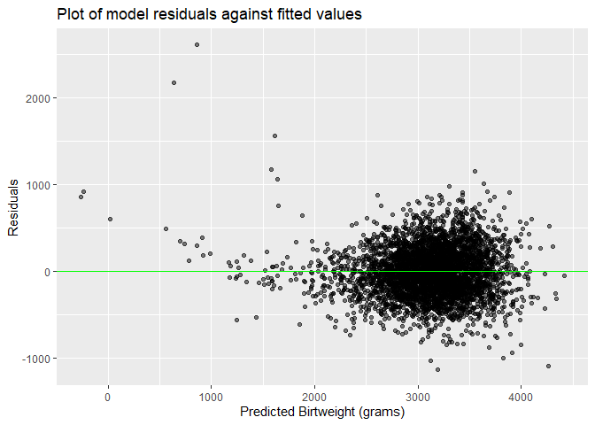

Homework 6
================
Lisa Eisler
11/22/2019

## Problem 1

Read in and clean birthweight data for regression. Create dichotomous
maternal race variable for regression (black vs. non-black/unknown).

``` r
birthweight_data = read_csv(file = "./data/birthweight.csv") %>% 
  janitor::clean_names() %>%
  mutate(
    babysex = factor(babysex, levels =  c("1", "2"), labels = c("male", "female")),
    frace = factor(frace, levels =  c("1", "2", "3", "4", "8", "9"), labels = c("white", "black", "asian", "puerto rican", "other", "unknown")),
    malform = factor(malform, levels =  c("0", "1"), labels = c("absent", "present")),
    mrace = factor(mrace, levels =  c("1", "2", "3", "4", "8"), labels = c("white", "black", "asian", "puerto rican", "other"))
  ) %>%
  mutate(mblack = ifelse(mrace == "black", "true", "false"))
birthweight_data
```

    ## # A tibble: 4,342 x 21
    ##    babysex bhead blength   bwt delwt fincome frace gaweeks malform menarche
    ##    <fct>   <dbl>   <dbl> <dbl> <dbl>   <dbl> <fct>   <dbl> <fct>      <dbl>
    ##  1 female     34      51  3629   177      35 white    39.9 absent        13
    ##  2 male       34      48  3062   156      65 black    25.9 absent        14
    ##  3 female     36      50  3345   148      85 white    39.9 absent        12
    ##  4 male       34      52  3062   157      55 white    40   absent        14
    ##  5 female     34      52  3374   156       5 white    41.6 absent        13
    ##  6 male       33      52  3374   129      55 white    40.7 absent        12
    ##  7 female     33      46  2523   126      96 black    40.3 absent        14
    ##  8 female     33      49  2778   140       5 white    37.4 absent        12
    ##  9 male       36      52  3515   146      85 white    40.3 absent        11
    ## 10 male       33      50  3459   169      75 black    40.7 absent        12
    ## # ... with 4,332 more rows, and 11 more variables: mheight <dbl>,
    ## #   momage <dbl>, mrace <fct>, parity <dbl>, pnumlbw <dbl>, pnumsga <dbl>,
    ## #   ppbmi <dbl>, ppwt <dbl>, smoken <dbl>, wtgain <dbl>, mblack <chr>

``` r
sum(!complete.cases(birthweight_data))
```

    ## [1] 0

*There are no missing data*

Propose a regression model for birthweight. This model may be based on a
hypothesized structure for the factors that underly birthweight, on a
data-driven model-building process, or a combination of the two.
Describe your modeling process and show a plot of model residuals
against fitted values – use add\_predictions and add\_residuals in
making this plot.

*Based on my clinical in the delivery room and NICU, I propose that
birthweight is modeled by the following factors: gestationl age, length,
head circumference, smoking status, income, and the number of prior low
birthweight babies born to the mother. I will also include maternal race
(black/non-black) given recent NYtimes coverage of the healthcare
disparities impacting black mothers and their babies even after other
factors such as SES are accounted for*

``` r
linearmodel_1 = lm(bwt ~ gaweeks + bhead + blength + smoken + fincome + pnumlbw, data = birthweight_data) 
linearmodel_1 %>% 
broom::tidy() %>% 
  select(term, estimate, p.value) 
```

    ## # A tibble: 6 x 3
    ##   term        estimate   p.value
    ##   <chr>          <dbl>     <dbl>
    ## 1 (Intercept) -6135.   0.       
    ## 2 gaweeks        14.2  4.98e- 21
    ## 3 bhead         137.   1.15e-283
    ## 4 blength        81.3  1.54e-288
    ## 5 smoken         -2.22 1.59e-  4
    ## 6 fincome         1.26 9.64e- 14

``` r
birthweight_data %>%
modelr::add_residuals(linearmodel_1) %>%
modelr::add_predictions(linearmodel_1) %>% 
ggplot(aes(x = pred, y = resid)) + geom_point(alpha = 0.5) + 
           geom_hline(yintercept = 0, color = "green") + 
  labs(
    title = "Plot of model residuals against fitted values",
    x = "Predicted Birtweight (grams)",
    y = "Residuals"
   )
```

    ## Warning in predict.lm(model, data): prediction from a rank-deficient fit
    ## may be misleading
    
    ## Warning in predict.lm(model, data): prediction from a rank-deficient fit
    ## may be misleading

<!-- -->
