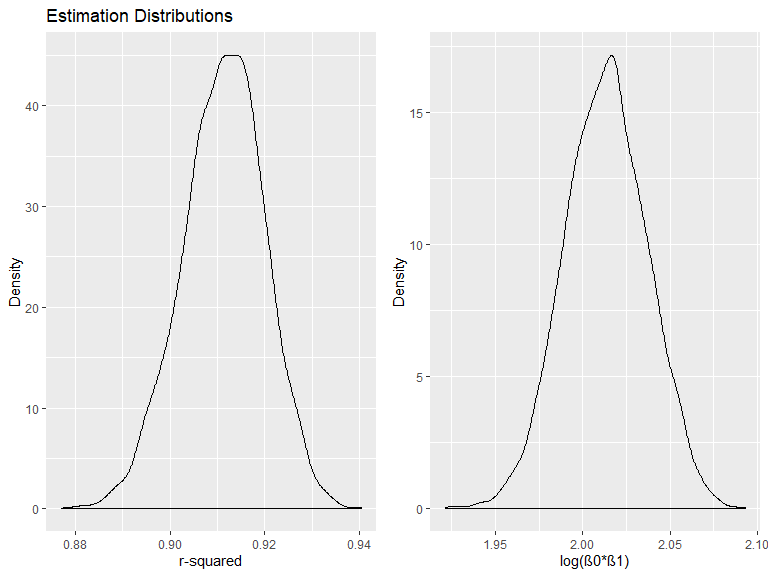

Homework 6
================
Lisa Eisler
11/22/2019

## Problem 1

Read in and clean birthweight data for regression.

``` r
birthweight_data = read_csv(file = "./data/birthweight.csv") %>% 
  janitor::clean_names() %>%
  mutate(
    babysex = factor(babysex, levels =  c("1", "2"), labels = c("male", "female")),
    frace = factor(frace, levels =  c("1", "2", "3", "4", "8", "9"), labels = c("white", "black", "asian", "puerto rican", "other", "unknown")),
    malform = factor(malform, levels =  c("0", "1"), labels = c("absent", "present")),
    mrace = factor(mrace, levels =  c("1", "2", "3", "4", "8"), labels = c("white", "black", "asian", "puerto rican", "other"))
  )
birthweight_data
```

    ## # A tibble: 4,342 x 20
    ##    babysex bhead blength   bwt delwt fincome frace gaweeks malform menarche
    ##    <fct>   <dbl>   <dbl> <dbl> <dbl>   <dbl> <fct>   <dbl> <fct>      <dbl>
    ##  1 female     34      51  3629   177      35 white    39.9 absent        13
    ##  2 male       34      48  3062   156      65 black    25.9 absent        14
    ##  3 female     36      50  3345   148      85 white    39.9 absent        12
    ##  4 male       34      52  3062   157      55 white    40   absent        14
    ##  5 female     34      52  3374   156       5 white    41.6 absent        13
    ##  6 male       33      52  3374   129      55 white    40.7 absent        12
    ##  7 female     33      46  2523   126      96 black    40.3 absent        14
    ##  8 female     33      49  2778   140       5 white    37.4 absent        12
    ##  9 male       36      52  3515   146      85 white    40.3 absent        11
    ## 10 male       33      50  3459   169      75 black    40.7 absent        12
    ## # ... with 4,332 more rows, and 10 more variables: mheight <dbl>,
    ## #   momage <dbl>, mrace <fct>, parity <dbl>, pnumlbw <dbl>, pnumsga <dbl>,
    ## #   ppbmi <dbl>, ppwt <dbl>, smoken <dbl>, wtgain <dbl>

``` r
sum(!complete.cases(birthweight_data))
```

    ## [1] 0

*There are no missing data*

Propose a regression model for birthweight. This model may be based on a
hypothesized structure for the factors that underly birthweight, on a
data-driven model-building process, or a combination of the two.
Describe your modeling process.

*Based on my clinical in the delivery room and NICU, I propose that
birthweight is predicted by: gestationl age, length, head circumference,
smoking status, income, and the number of prior low birthweight babies
born to the mother.*

``` r
bwtmodel_1 = lm(bwt ~ gaweeks + bhead + blength + smoken + fincome + pnumlbw, data = birthweight_data)
bwtmodel_1 %>%
  summary()
```

    ## 
    ## Call:
    ## lm(formula = bwt ~ gaweeks + bhead + blength + smoken + fincome + 
    ##     pnumlbw, data = birthweight_data)
    ## 
    ## Residuals:
    ##      Min       1Q   Median       3Q      Max 
    ## -1124.92  -190.90   -10.16   180.20  2604.06 
    ## 
    ## Coefficients: (1 not defined because of singularities)
    ##               Estimate Std. Error t value Pr(>|t|)    
    ## (Intercept) -6134.6881    96.0588 -63.864  < 2e-16 ***
    ## gaweeks        14.2282     1.5043   9.458  < 2e-16 ***
    ## bhead         136.6187     3.5160  38.857  < 2e-16 ***
    ## blength        81.2980     2.0716  39.245  < 2e-16 ***
    ## smoken         -2.2173     0.5867  -3.780 0.000159 ***
    ## fincome         1.2552     0.1680   7.470 9.64e-14 ***
    ## pnumlbw             NA         NA      NA       NA    
    ## ---
    ## Signif. codes:  0 '***' 0.001 '**' 0.01 '*' 0.05 '.' 0.1 ' ' 1
    ## 
    ## Residual standard error: 284 on 4336 degrees of freedom
    ## Multiple R-squared:  0.6928, Adjusted R-squared:  0.6924 
    ## F-statistic:  1955 on 5 and 4336 DF,  p-value: < 2.2e-16

*show table with parameters and p-value*

``` r
bwtmodel_1 %>%
  broom::tidy() %>% 
  select(term, estimate, p.value) %>% 
  knitr::kable(digits = 5)
```

| term        |     estimate | p.value |
| :---------- | -----------: | ------: |
| (Intercept) | \-6134.68807 | 0.00000 |
| gaweeks     |     14.22821 | 0.00000 |
| bhead       |    136.61868 | 0.00000 |
| blength     |     81.29796 | 0.00000 |
| smoken      |    \-2.21735 | 0.00016 |
| fincome     |      1.25525 | 0.00000 |

Show a plot of model residuals against fitted values.

    ## Warning in predict.lm(model, data): prediction from a rank-deficient fit
    ## may be misleading
    
    ## Warning in predict.lm(model, data): prediction from a rank-deficient fit
    ## may be misleading

<!-- -->

Create comparison models: One using length at birth and gestational age
as predictors (main effects only) and one using head circumference,
length, sex, and all interactions (including the three-way interaction)
between these.

``` r
bwtmodel_2 = lm(bwt ~ gaweeks + blength, data = birthweight_data) 
bwtmodel_3 = lm(bwt ~ bhead + blength + babysex + bhead * blength + bhead * babysex + blength * babysex + bhead * blength * babysex, data = birthweight_data)
```

Make a comparison of these two models with your model in terms of the
cross-validated prediction error.

<!-- -->

*Based on RMSE, the model I developed (bwtmodel\_1) appears to be the
best fit for the data, and in addition contains a moderate amount of
complexity compared with models 2 (too simple) and 3 (too complex with
interaction terms).*

## Problem 2

Download Central Park Weather Data

``` r
weather_df = 
  rnoaa::meteo_pull_monitors(
    c("USW00094728"),
    var = c("PRCP", "TMIN", "TMAX"), 
    date_min = "2017-01-01",
    date_max = "2017-12-31") %>%
  mutate(
    name = recode(id, USW00094728 = "CentralPark_NY"),
    tmin = tmin / 10,
    tmax = tmax / 10) %>%
  select(name, id, everything())
```

    ## Registered S3 method overwritten by 'crul':
    ##   method                 from
    ##   as.character.form_file httr

    ## Registered S3 method overwritten by 'hoardr':
    ##   method           from
    ##   print.cache_info httr

    ## file path:          C:\Users\Lisa Eisler\AppData\Local\rnoaa\rnoaa\Cache/ghcnd/USW00094728.dly

    ## file last updated:  2019-09-26 10:29:40

    ## file min/max dates: 1869-01-01 / 2019-09-30

``` r
weather_df
```

    ## # A tibble: 365 x 6
    ##    name           id          date        prcp  tmax  tmin
    ##    <chr>          <chr>       <date>     <dbl> <dbl> <dbl>
    ##  1 CentralPark_NY USW00094728 2017-01-01     0   8.9   4.4
    ##  2 CentralPark_NY USW00094728 2017-01-02    53   5     2.8
    ##  3 CentralPark_NY USW00094728 2017-01-03   147   6.1   3.9
    ##  4 CentralPark_NY USW00094728 2017-01-04     0  11.1   1.1
    ##  5 CentralPark_NY USW00094728 2017-01-05     0   1.1  -2.7
    ##  6 CentralPark_NY USW00094728 2017-01-06    13   0.6  -3.8
    ##  7 CentralPark_NY USW00094728 2017-01-07    81  -3.2  -6.6
    ##  8 CentralPark_NY USW00094728 2017-01-08     0  -3.8  -8.8
    ##  9 CentralPark_NY USW00094728 2017-01-09     0  -4.9  -9.9
    ## 10 CentralPark_NY USW00094728 2017-01-10     0   7.8  -6  
    ## # ... with 355 more rows

Focus on a simple linear regression with tmax as the response and tmin
as the predictor:

``` r
lm(tmax ~ tmin, data = weather_df) %>% 
  broom::tidy() %>% 
  knitr::kable(digits = 3)
```

| term        | estimate | std.error | statistic | p.value |
| :---------- | -------: | --------: | --------: | ------: |
| (Intercept) |    7.209 |     0.226 |    31.847 |       0 |
| tmin        |    1.039 |     0.017 |    61.161 |       0 |

We are interested in the distribution of two quantities estimated from
these data: r^2 and log(β<sup>0∗β</sup>1). Use 5000 bootstrap samples
and, for each bootstrap sample, produce estimates of these two
quantities.

``` r
weather_estimates =
weather_df %>% 
  modelr::bootstrap(n = 5000) %>% 
  mutate(
    models = map(strap, ~lm(tmax ~ tmin, data = .x)),
    results = map(models, broom::tidy), 
    glance = map(models, broom::glance)) %>% 
  select(results, glance) %>% 
  unnest(results, glance) %>% 
  janitor::clean_names() %>% 
  select(term, estimate, r_squared) %>% 
  pivot_wider(
    names_from = term, 
    values_from = estimate)  %>% 
  janitor::clean_names() %>% 
  mutate(log_est = log(intercept * tmin)) 
```

    ## Warning: unnest() has a new interface. See ?unnest for details.
    ## Try `df %>% unnest(c(results, glance))`, with `mutate()` if needed

Plot the distribution of your estimates.

``` r
rsquared_plot = 
  weather_estimates %>% 
  ggplot(aes(x = r_squared)) +
  geom_density()

logbetas_plot = 
  weather_estimates %>% 
  ggplot(aes(x = log_est)) +
  geom_density()

(rsquared_plot + logbetas_plot)
```

<!-- -->

Using the 5000 bootstrap estimates, identify the 2.5% and 97.5%
quantiles to provide a 95% confidence interval for r^2 and
log(β<sup>0∗β</sup>1).
